# Kali Linux Kurulumu

## NAT Network Kurulumu

- İlk olarak **File** menüsü altından **Preferences** kısmı açılır.


- Açılan menüden **Network** alt menüsüne geçilir. Buradan sağ tarafta yer alan **Adds new NAT network** butonuna tıklanır.

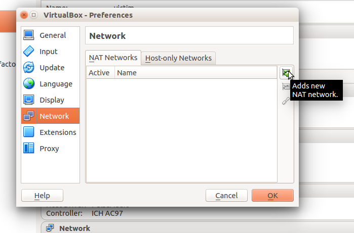

- Burada **NatNetwork** seçmesine çift tıklanıp **OK** butonuna tıklanır.

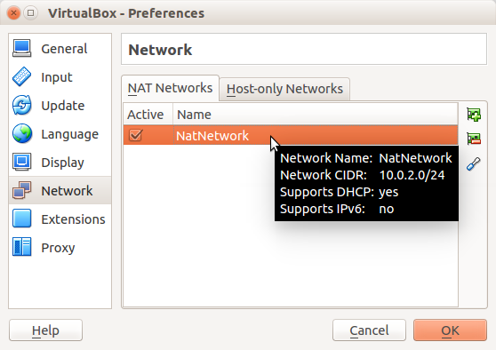

- Network ismi belirlenip devam edilir.

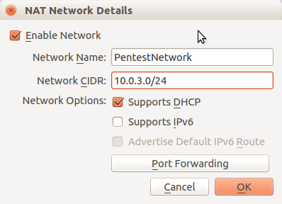

- Resimdeki gibi seçilerek devam edilir.


## Sanal Makinenin Oluşturulması

- Sanal makineyi açıp, sol üstteki  **New** butonuna tıklıyoruz. 

)

- Sanal makinenin ismini belirleyip  **Type** ve **Version** kısımları aşağıdaki gibi seçiyoruz.

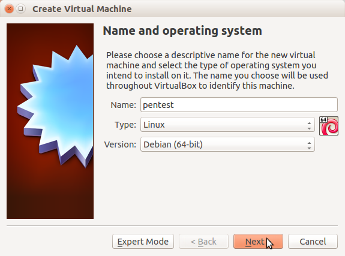

- **Memory Size** 1024 MB olarak belirliyoruz ve **next** diyoruz.

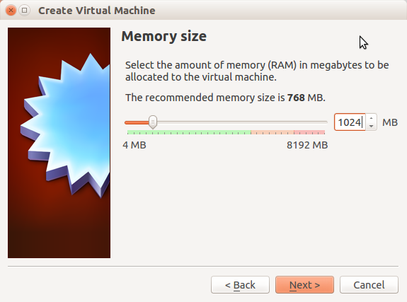

- **Create a virtual hard disk now** seçeneğini seçip devam ediyoruz.
 


- **VDI** seçeneğini seçip devam ediyoruz.


- **Dynamically allocated** seçeneğini seçip devam ediyoruz.


- File boyutunu 20 GB yapıp **Create** diyoruz.

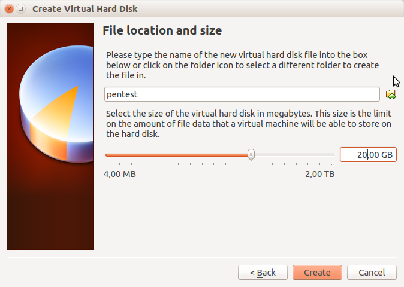

- **pentest** isimli sanal makinemiz  aşağıdaki gibi oluşmuş oluyor.


- Burada **Setting** butonuna tıklıyoruz.


- Sağ kısımdan **Network** butonuna tıklayıp resimdeki seçenekleri seçiyoruz.

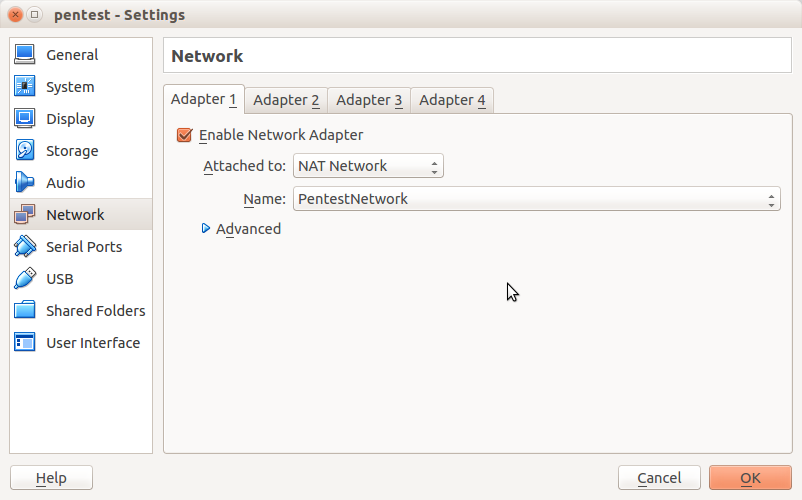

- Daha sonra sol kısımdan **Storage** butonuna tıklayıp, **Empty** seçmesine geçiyoruz.


- Burada aşağıdaki gibi **Choose Virtual Optical Disk File** diyoruz.

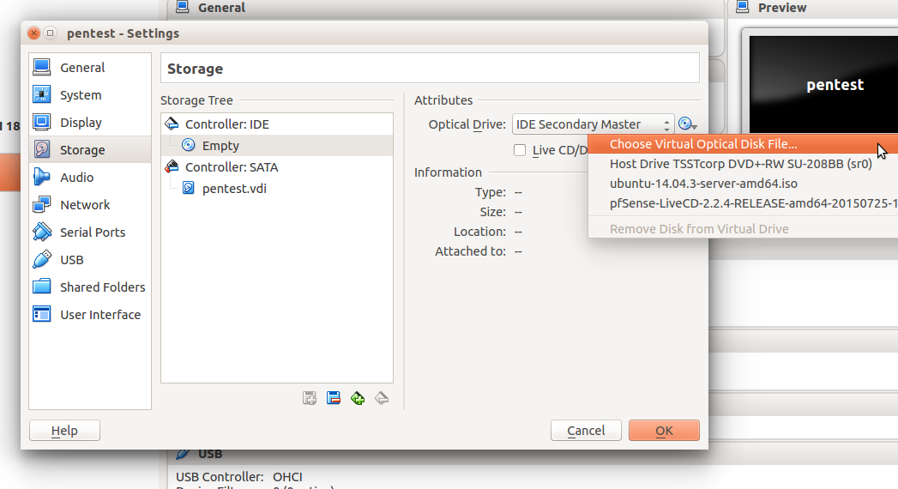

- Ve iso dosyasını seçiyoruz.


- **OK** deyip devam ediyoruz.

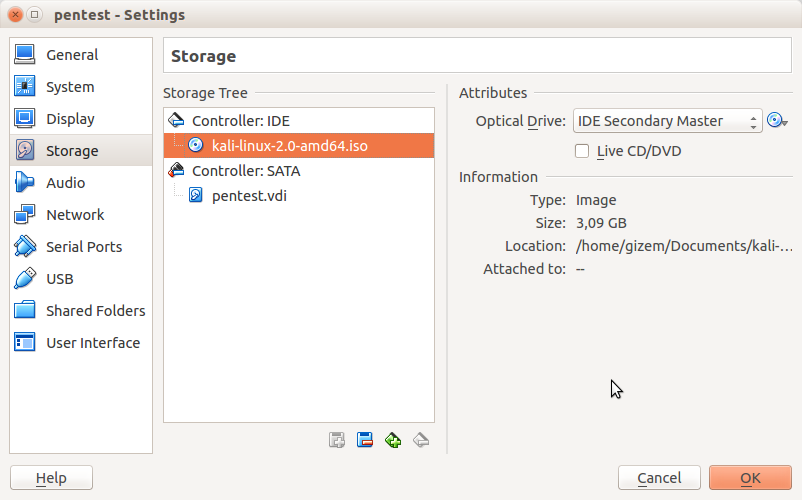

## Kali Linux Kurulumu

- Sanal makineyi açıp pentest makinesini seçip **Start** butonuna tıklıyoruz.


- Aşağıdaki gibi **Install** seçmesini seçip devam ediyoruz.


- Buradan dil olarak **English** seçiyoruz. Siz Türkçe de seçebilirsiniz.


- Ülke seçiminde önce **Other** seçmesini seçip,


- **Asia** deyip,


- **Turkey** seçiyoruz.


- Daha sonra aşağıdaki gibi seçip devam ediyoruz.

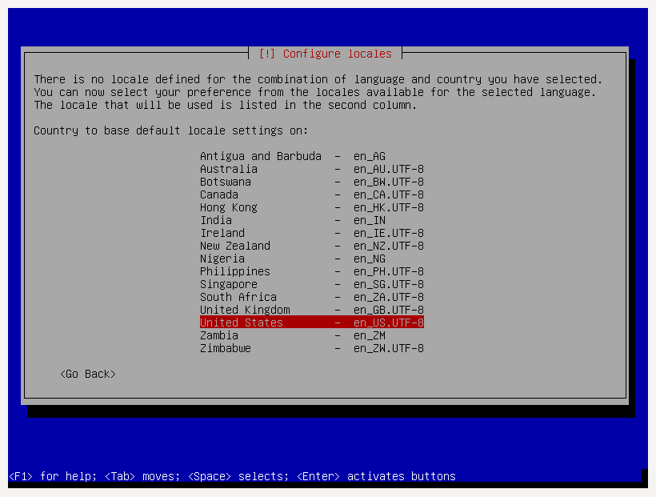

- Aşağıdaki gibi Türkçe klavye seçip devam ediyoruz.


- Burada kurulumu bekliyoruz.


- Burada **Hostname** belirleyip devam ediyoruz.


- **Domain** kısmına boşluk koyup devam ediyoruz.


- Parolamızı giriyoruz.


- Bekliyoruz.

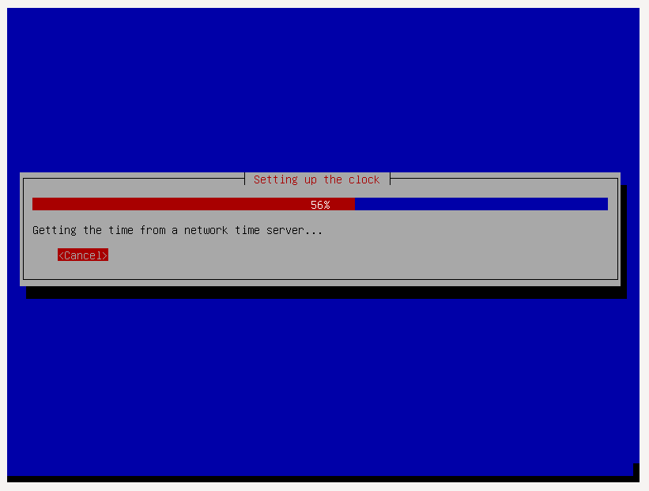

- Aşağıdaki gibi seçip devam ediyoruz.

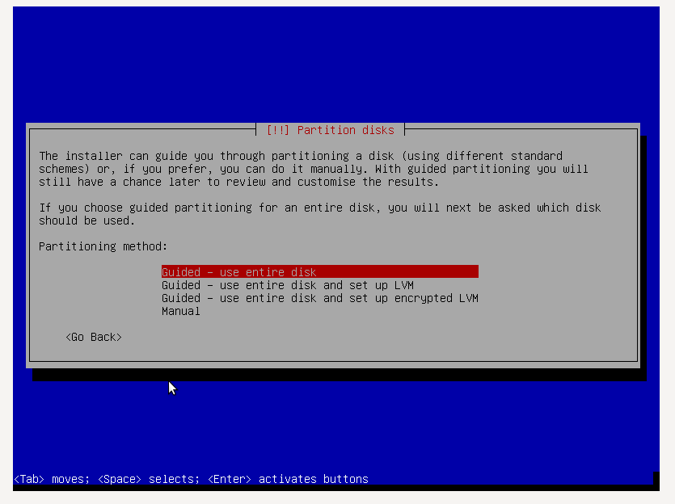

- Aşağıdaki gibi seçip devam ediyoruz.


- Aşağıdaki gibi seçip devam ediyoruz.


- Aşağıdaki gibi seçip devam ediyoruz.


- **Yes** deyip devam ediyoruz.


- Verilerin diske kopyalanmasını bekliyoruz.


- Burada **Yes** diyip devam ediyoruz.


- Direk **continue** diyip devam ediyoruz.


- **Yes** diyip devam ediyoruz.

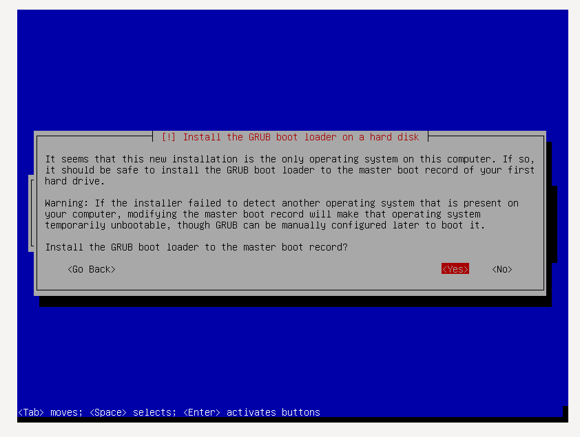

- Aşağıdaki gibi seçip devam ediyoruz.


- Bekliyoruz.


- **Continue** deyip devam ediyoruz.

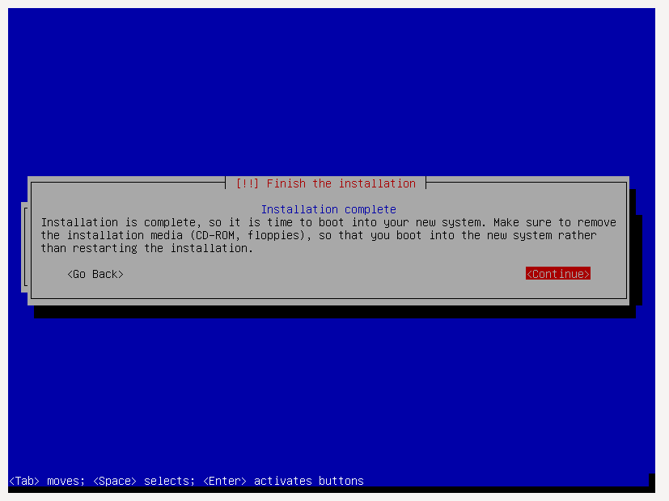

- Burada sağ alttaki kısımda hiçbirşeyin seçili olmadığından emin oluyoruz.


- **Username** giriyoruz.


- **Password** giriyoruz. Kali'yi açmış bulunmaktayız.


## Guest Eklentilerinin Kurulumu

- Terminal'i açıyoruz.


```
cp /media/cdrom0 vbox -r
cd vbox/
./VBoxLinuxAdditions.run
```
- Komutlarını aşağıdaki gibi sırayla çalıştırıyoruz.


- **Machine -> Reset Host** deyip sistemi baştan başlatıyoruz ve kurulumu tamamlamış oluyoruz.


## Sistemin Güncellenmesi

- Aşağıdaki komutu çalıştırarak sistemi güncelleyebilirsiniz.

```sudo apt-get update && apt-get upgrade && apt-get disk-upgrade && apt-get -f install && apt-get autoremove```


