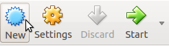
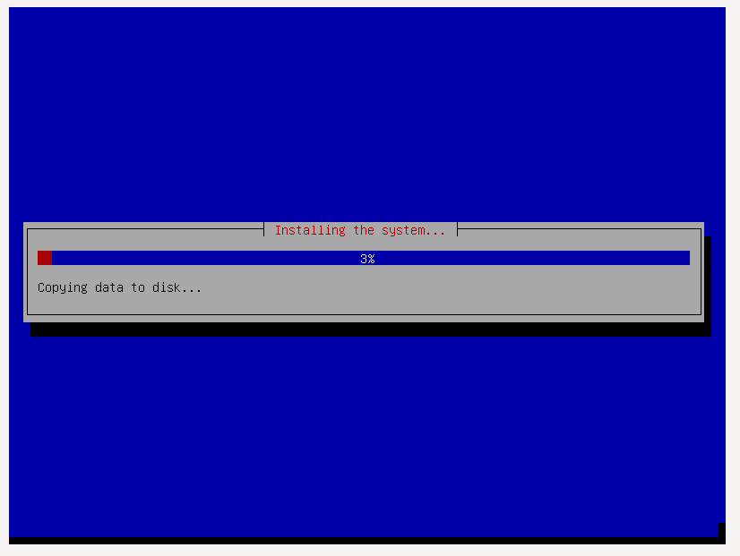
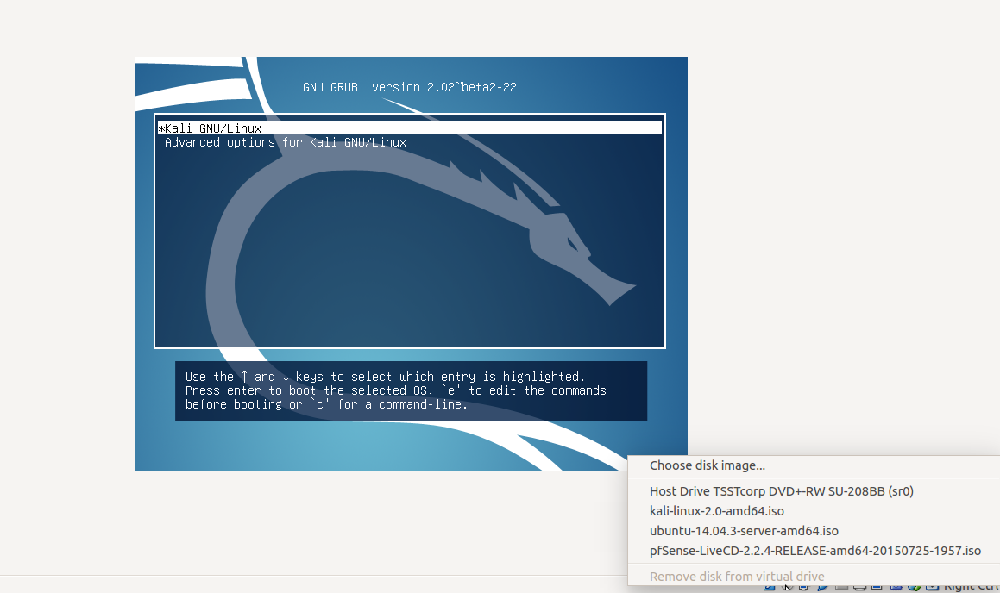

# Kali Linux Kurulumu

## NAT Network Kurulumu

- İlk olarak **File** menüsü altından **Preferences** kısmı açılır.


- Açılan menüden **Network** alt menüsüne geçilir. Buradan sağ tarafta yer alan **Adds new NAT network** butonuna tıklanır.


- Burada yeni eklenen **NatNetwork** seçeneğine çift tıklanır.


- Network ismi ve ip aralığı belirlenir.


- Resimdeki gibi seçilerek devam edilir.


## Sanal Makinenin Oluşturulması

- Yeni bir sanal makine oluşturmak için **New** butonuna tıklıyoruz. 



- Sanal makinenin ismini belirleyip  **Type** ve **Version** kısımları aşağıdaki gibi seçiyoruz.


- **Memory Size** 1024 MB olarak belirliyoruz ve **next** diyoruz.


- **Create a virtual hard disk now** seçeneğini seçip devam ediyoruz.
 


- **VDI** seçeneğini seçip devam ediyoruz.


- **Dynamically allocated** seçeneğini seçip devam ediyoruz.


- File boyutunu 20 GB yapıp **Create** diyoruz.


- **pentest** isimli sanal makinemiz  aşağıdaki gibi oluşmuş oluyor.


- Burada yeni oluşturulan sanal makine seçili iken **Settings** butonuna tıklıyoruz.


- Sağ kısımdan **Network** butonuna tıklayıp daha önceden oluşturduğumuz NAT networkünü seçiyoruz.


- Daha sonra sol kısımdan **Storage** kısmına geçiyoruz.


- Burada aşağıdaki gibi **Choose Virtual Optical Disk File** diyoruz.


- İndirdiğimiz Kali Linux imajının yolunu seçiyoruz.


- **OK** deyip devam ediyoruz.


## Kali Linux Kurulumu

- Yeni oluşturduğumuz sanal makineyi çalıştırmak için **Start** butonuna tıklıyoruz.


- Aşağıdaki gibi **Install** seçmesini seçip devam ediyoruz.


- Buradan dil olarak **English** seçiyoruz. Siz Türkçe de seçebilirsiniz.


- Ülke seçiminde önce **Other** seçmesini seçip,


- **Asia** deyip,


- **Turkey** seçiyoruz.


- Daha sonra aşağıdaki gibi seçip devam ediyoruz. Buraları kendinize uygun olarak değiştirebilirsiniz.


- Aşağıdaki gibi Türkçe klavye seçip devam ediyoruz.


- Burada kurulumu bekliyoruz.


- **Hostname** belirleyip devam ediyoruz.


- **Domain** kısmını boş bırakıyoruz.


- Parolamızı giriyoruz. Onay kutucuğu geldiğinde tekrardan giriyoruz.


- Bekliyoruz.


- Sanal makine içerisindeki tüm diski kullanmak adına aşağıdaki gibi seçebiliriz. Full-disk encryption özelliği ile birlikte kuracaksanız **Guided - use entire disk and set up encrypted LVM** seçeneğini seçebilirsiniz.


- Aşağıdaki gibi seçip devam ediyoruz.


- Tüm dosyaları tek bölümde tutabiliriz. Bunun için aşağıdaki seçeneği seçiyoruz.


- Bölümleme işini bitiriyoruz.


- **Yes** deyip devam ediyoruz.


- Verilerin diske kopyalanmasını bekliyoruz.



- Burada **Yes** diyip devam ediyoruz.


- Direk **continue** diyip devam ediyoruz.


- **Yes** diyip devam ediyoruz.


- Aşağıdaki gibi seçip devam ediyoruz.


- Bekliyoruz.


- **Continue** deyip devam ediyoruz.


- Burada sağ alttaki kısımda hiçbirşeyin seçili olmadığından emin oluyoruz.



- **Username** giriyoruz.


- **Password** giriyoruz. Eğer herhangi bir problem yoksa önünüze masaüstü gelmesi gerekiyor.


## Guest Eklentilerinin Kurulumu

- İlk önce **Devices** menüsü altından **Insert Guest Additions CD image** seçeneği ile cd'yi bağlıyoruz.


- Terminal'i açıyoruz.


```
cp /media/cdrom0 vbox -r
cd vbox/
./VBoxLinuxAdditions.run
```
- Komutlarını aşağıdaki gibi sırayla çalıştırıyoruz.


- **Machine->Reset Host** deyip sistemi baştan başlatıyoruz ve kurulumu tamamlamış oluyoruz. Burada doğrudan komut satırından **reboot** komutu verilerek de sistem yeniden başlatılabilir.


## Sistemin Güncellenmesi

- Aşağıdaki komutu çalıştırarak sistemi güncelleyebilirsiniz.

```sudo apt-get update && apt-get upgrade && apt-get disk-upgrade && apt-get -f install && apt-get autoremove```


## Snapshot Alınması

- Tüm işlerinizi tamamladıysanız sol üstten **Snapshot** seçmesine tıklayıp aşağıdaki gibi makinenizin son durumunun snapshot'ını alabilirsiniz.


