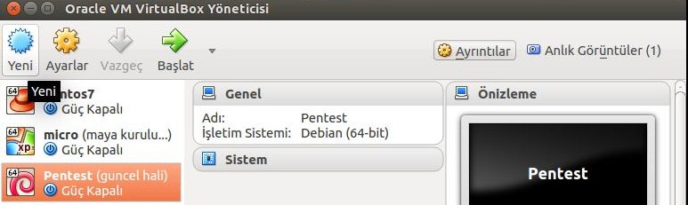
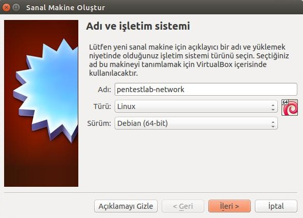
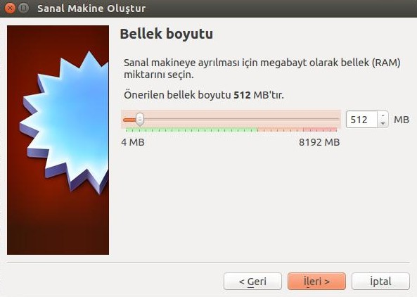
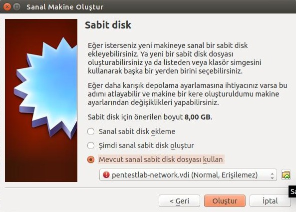
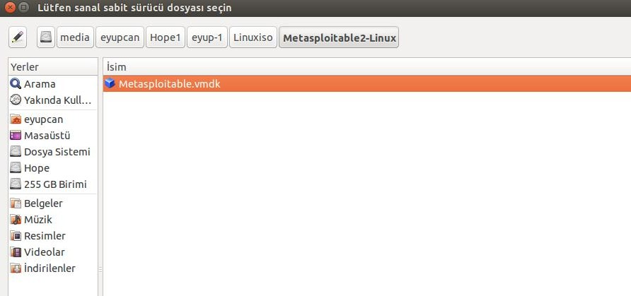
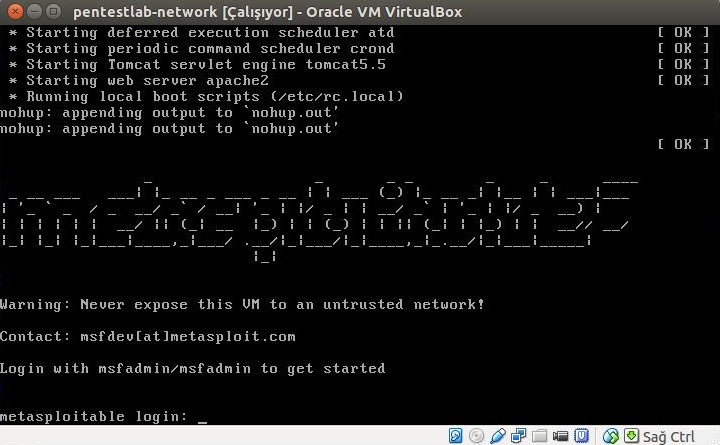
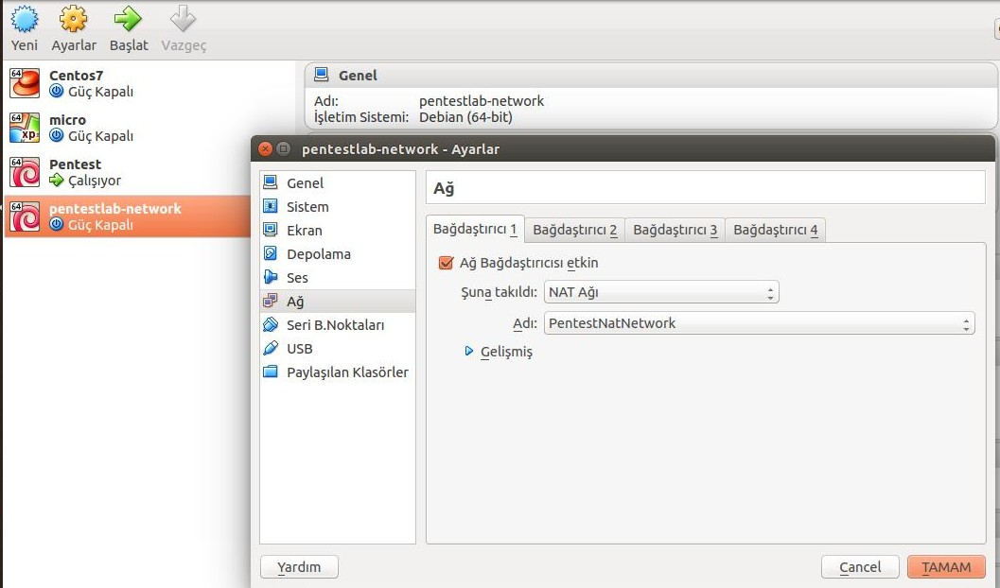
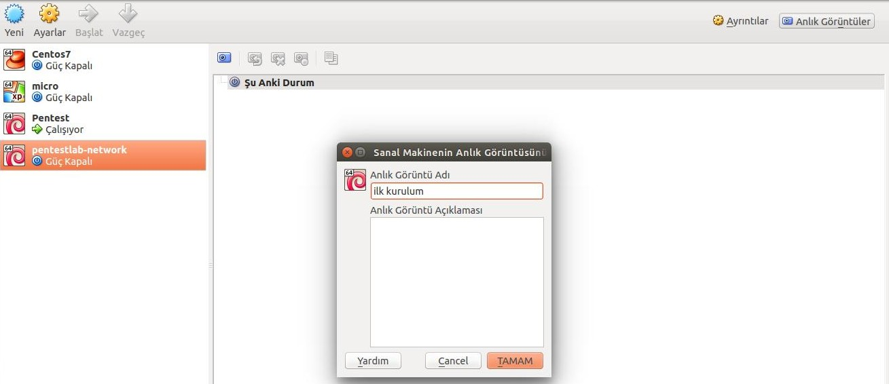

# Metasploitable

## Sanal Makine Oluşturulması

- İlk olarak yeni bir sanal makine oluşturmak için **Yeni** butonuna tıklıyoruz.

- Sanal makinenin ismini belirleyip **Türü** ve **Sürüm** kısımlarını aşağıdaki gibi seçiyoruz.

- **Bellek Boyutu** 512 MB olarak belirliyoruz ve **İleri** diyoruz.

- **Mevcut sanal sabit disk dosyasi kullan** (Use an existing virtual hard disk file) seçeneğini seçiyoruz.

- Sağ alttaki dizin butonuna tıklayarak daha önceden indirdiğiniz **Metasploitable.vmdk** dosyasını seçiyoruz.

- Bu aşamadan sonra **Oluştur** diyoruz.

- Sanal makinemizi çalıştırdıktan sonra aşağıdaki gibi bir ekran karşımıza geliyor.

## Nat Network Kurulumu

- Nat network kurulumu [burada][1] anlatılmıştır.
- Daha önce Nat network ağını kurduysanız **pentestlab-network** sanal makinanızın **ayarlar->ağ** bölümünden Nat ağını seçebilirsiniz.

## Snapshot Alınması

- Sanal makineniz seçili iken sağ üst köşedeki **Anlık Görüntüler** (Snapshot) seçmesine tıklayarak aşağıdaki gibi anlık görüntü alabilirsiniz.

[1]: kali-linux-kurulumu.md
