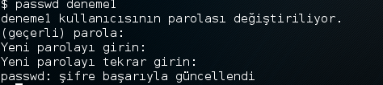
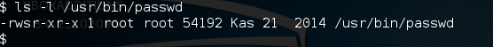
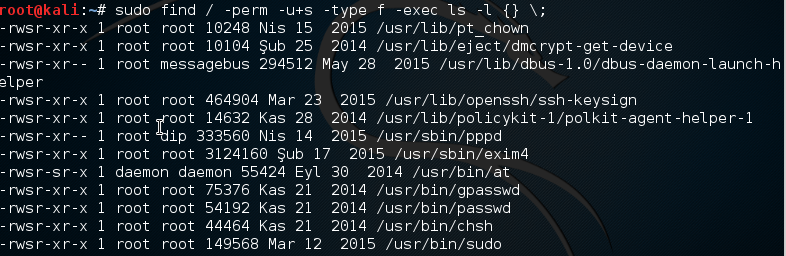
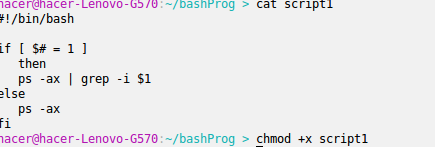
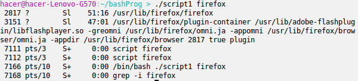
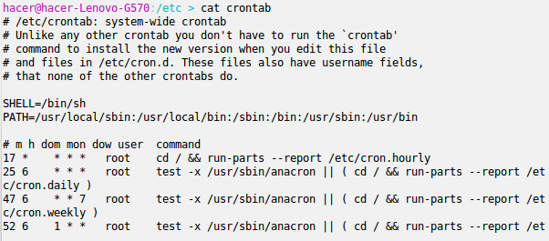
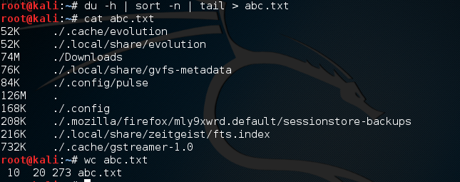

# SUID Biti

- Bir kullanıcının, bir programı kendisine tanınmış haklardan daha fazla izne sahip olarak çalıştırması gerektiği durumlarda kullanılmaktadır
- Yani herhangi bir program herhangi bir kullanici tarafından program sahibinin haklarıyla çalıştırılabilir.
- Örnek olarak kullanıcıların şifrelerinin tutulduğu /etc/shadow dosyasına sadece root kullanıcısı olarak erişebiliriz.
- Aşağıda deneme1 adlı kullanıcı oluşturulup **su** komutu ile kullanıcıya geçiş yapılmıştır.

 

- **passwd** komutu ile bir kullanıcıya parola atamak için kullanılır. 
- Yani bu komutu kullanarak şifresini değiştiren bir kullanıcı shadow dosyası üzerinde değişiklik yapmış olur.

 

- Yetkimizin olmadığı bir dosyada değişiklik yapabilmemizin nedeni /usr/bin/passwd dosyasında **suid** bitinin etkinleştirilmiş olmasından kaynaklanıyor.
- Aşağıda yer alan izin diziliminde geçen 's' biti suid bitinin aktifliğini göstermektedir.

 

- SUID biti  durumu dikkat edilmesi gereken bir konudur.
- Çünkü kötü amaçlı bir kimse bu biti aktif edilmiş bir programda kendini root yapmaya çalışabilir.
- Sistemdeki suid biti aktif edilmiş dosyalara aşağıdaki komut ile ulaşılanabilir. 

```
sudo find / -perm -u+s -type f -exec ls -l {} \ ;
```

 

- Sistem de çalışan süreçleri ve bu süreçlerin id lerini görüntülemek için ps komutundan yararlanılabilir.
- Aşağıdaki script ile parametre olarak verilen processin çalışıp çalışmadığının kontrolü yapılıp ilgili bilgileri ekrana yazdırılıyor.

 

 

# Crontab

- Crontab belirlenen bir zaman diliminde istenilen scriptlerin ya da programların çalışmasını sağlar.Yani bir görev planlayıcısıdır.
- Mesala belli zaman aralıklarında dosyalarımızın yedeklerini almak için kullanabiliriz.
- Aşağıdaki resimde /etc dizini altındaki crontab dosyasının içeriği gösterilmektedir.

 

- Aşağıdaki komut ile **crontab** dosyasını editleyebiliriz. **nano** kullanarak yapabilirsiniz.

 

- Sonra planlamak istediğiniz görevi aşağıdaki gibi ekleyebilirsiniz.
- Burada sondan itibaren ilk * karakteri : Haftanın Günleri (0-6 Pazar:0)
- İkinci : Ay(1-12)
- Ucuncu : Ayın Günleri(1-31)
- Dorduncu : Saat(0-23)
- Besinci : Dakika(0-59)
- Aşağıda script2 dosyasının her 2 dakikada bir çalıştırmaya ayarlanması gösterilmektedir.

 

- **du**  komutu bulunduğu dizinin alt klasörlerde dahil toplam boyutunu verir.
- **sort** komutu ise sıralama yapar.
- **wc** komutu parametre olarak verilen dosyadaki satır, kelime ve karakter sayısını gösterir.
- Bu komutların birlikte kullanımı aşağıdaki resimden görülebilir.

 


