# Truecrypt kurulumu ve kullanımı

## Truecrypt Hakkında

- Sabit disklerin ve özellikle Usb belleklerin şifrelenmesi için tercih edilen bir yazılımdır.
- Bu yazılım kim tarafından geliştirildiği bilinmemektedir. Ancak istihbarat servislerinin bu kişi üzerine arama yapıldığı bilinmekteydi. Bu bilgi eşliğinde site içerisinde son zamanlarda yayınlanan bir yazıda "Bu yazılımın güvenli değil" duyurusu yapıldı. 

## Truecrypt Kurulum Platformu

- En son sürümü yayınlanan [Truecrypt 7.2][1], windows platformunda kurulum yapan arkadaşlar için şifreleme yapmamakta, sadece şifreli alanlara ulaşmanızda yardımcı olmaktadır.
- Bunun için windows platformunda kurulum yapmak için [Truecrypt 7.1][2] dağıtımlarından birisini kurmalısınız. Kendi sitesinde eski dağıtımlara ulaşmak mümkün olmadığı gibi bu dağıtımları [github][2] üzerinden ulaşmanız mümkündür.
- Windows ortamında kurulum sıradan next adımları ile rahatlıkla kurulmaktadır.

## Linux platformunda Truecrypt Kurulumu

> sudo add-apt-repository ppa:stefansundin/truecrypt

> sudo apt-get update

> sudo apt-get install truecrypt

- Yukarıdaki linux kodlarını sırasıyla terminal üzerinde çalıştırıyoruz. 

> /etc/apt/sources.list.d/*********.list.save

- Yukarıdaki gibi bir hata ile karşılaşırsanız aşağıdaki kod satırını çalıştırarak çözüm bulmanız mümkün. Ancak bu kodların ne işe yaradığını araştırarak yapmanızı tavsiye ederim.

>sudo rm -rm /etc/apt/sources.list.d

- İşlem bittikten sonra terminal üzerinden truecrypt yazarak programı çalıştırmanız mümkündür. 

## Truecrypt usb şifreleme yöntemi

- Programı çalıştırdıktan sonra aşağıdaki görselleri takip edebilirsiniz.

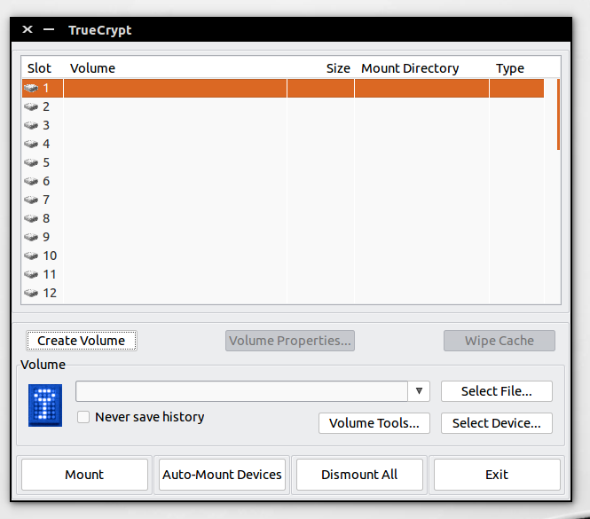

> Create Volum seçeneğini tıklamayın. Eğer bu buton görünmüyorsa, sürümün 7.2 olmadığını kontrol etmelisiniz. Sürüm sıkıntısını yukarıda bahsettik.

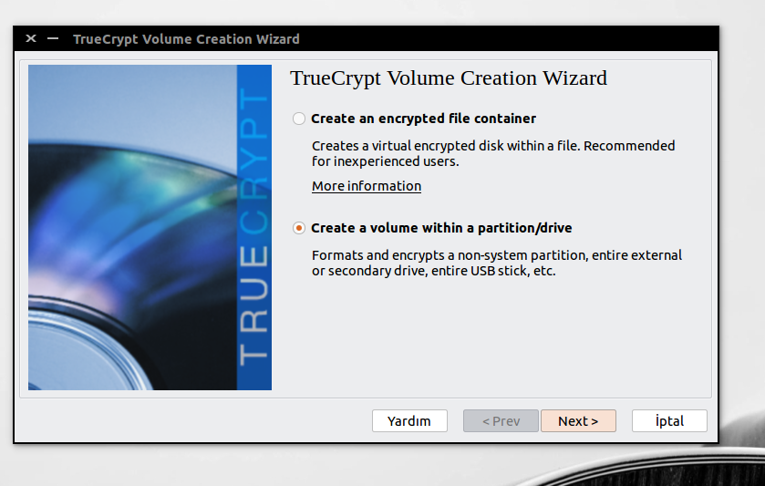

> Karşımızda 2 seçenek bulunuyor. 1. seçenek diskten belirli bir parçayı şifreleme işlemi için tercih edilir.

> 2. işlemde ise usb bellek gibi bir cihazın tamamını şifreleme işlemini yapmanızı sağlar. 2. işlemi seçerek devam edelim.

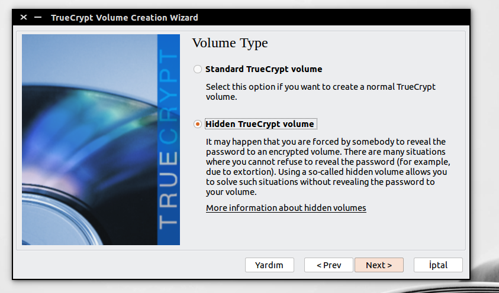

> 1. işlem sıradan şifre oluşturmanızı sağlar.

> 2. işlem şifreleme yaptığınız alanın içerisinde özel bir yeni şifreleme yapmanızı sağlar. Yani cihazı farklı 2 şifre ile açabilirsiniz. Dosyalarınızı saklamak için sıradan şifreleme yapabilir, daha özel ve ulaşılmasını istemediğiniz verileri 2. özel bir şifre ile koruyabilirsiniz.

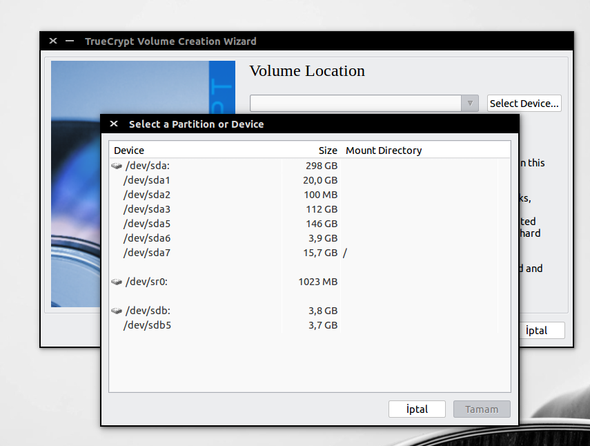

> Select Device tıklayarak resimdeki diskler arasında şifrelemek istediğiniz cihazı seçmelisiniz. Next ile ilerlemelisiniz.

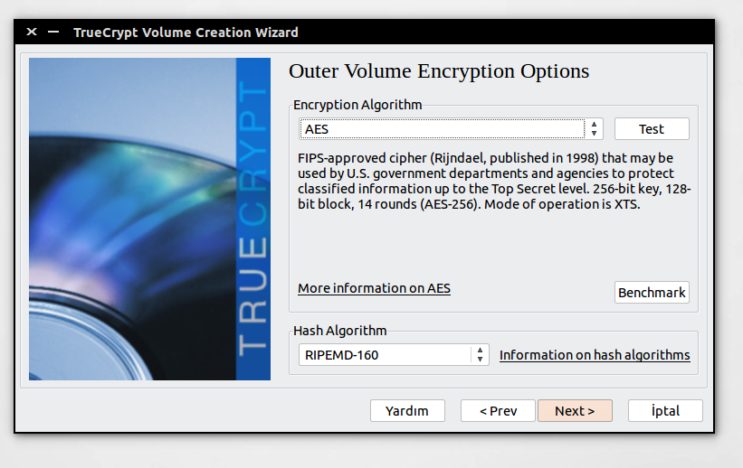

> Şifreleme ve Hash yöntemlerini seçmelisiniz. İlk başta default seçenekler ile işlemi tamamlamanızı öneririm. Next ile ilerlemelisiniz.

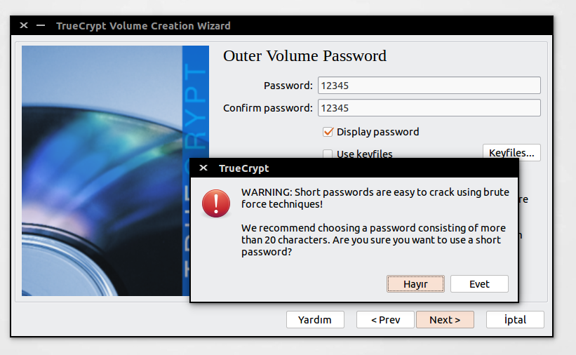

> Şimdi şifre oluşturmalısınız. Bu usb için standart şifreleme alanını açacak bölümdür.

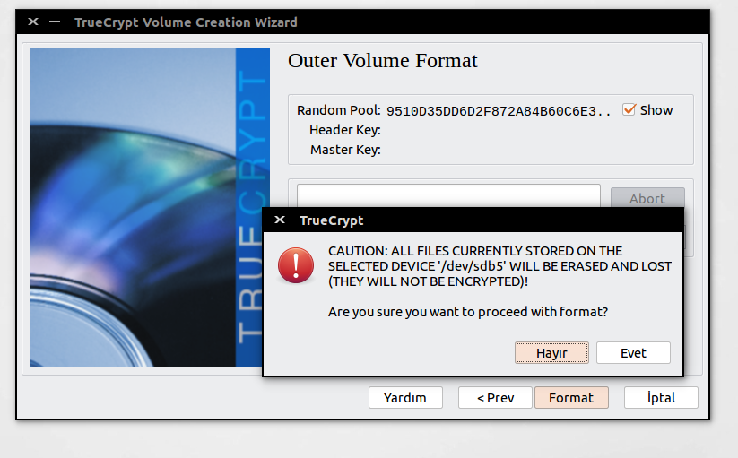

> Sizin maus hareketlerinize göre seçtiğiniz algoritmik değerler üretilen pencereye geldiniz. Burada random değerlerle format seçeneğine tıklamalı ve karşınıza çıkan uyarıyı dikkate alarak işleme başlamalısınız. Bir süre boyunca diskiniz işlem yaptıktan sonra şifreleme işiniz bitmiş olacak. 

- Bu işlem bittikten sonra karşınıza klasör gelecektir ve şifreleme işlemi için arayüz size yönlendirme yapacaktır. Yine next dedikten sonra karşınıza hash ve şifreleme algoritmaları seçme arayüzü gelecektir.

- Bu arayüzleri yukarıda anlattığım için resimsel olarak eklemiyorum. Aşağıdaki görsele kadar next demeniz yeterli olacaktır.

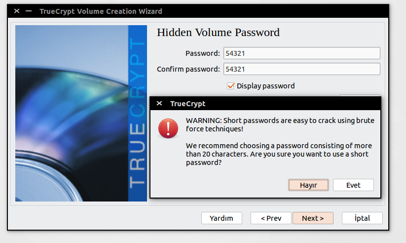

> Şifreyi belirledikten sonra yukarıdaki iterasyonu devam ettirelim.

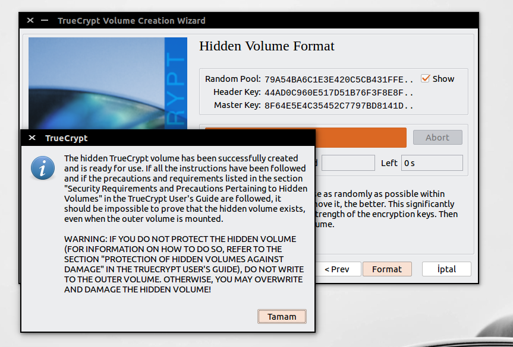

> Tamam diyip işlemi bitirelim.

- Şifreleme işlemimiz tamamlanmıştır.

## Truecrypt şifrelenmiş cihazı kullanmak

- Bu işlemi yapmak için Truecrypt programına sahip olmanız gerekmektedir. Programı çalıştırdıktan sonra Volume üzerinden cihazını seçmelisiniz. Aşağıda şifreli cihazımıza standart şifremiz ile girdiğimi; daha özel durumlar için ayırdığımız alana ise sonradan oluşturduğumuz şifreyi kullanarak girdiğimi göstereceğim.

### Şifrelenmiş alan

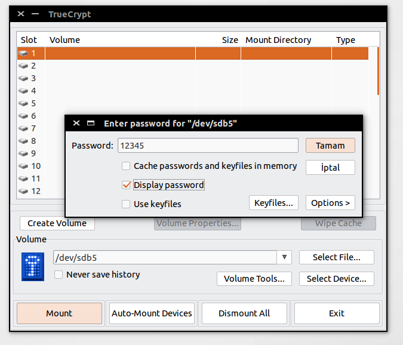

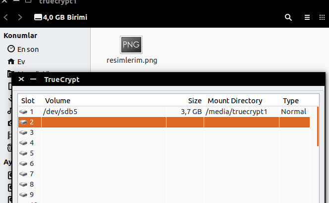

### Şifrelenmiş alan içinde gizli alan

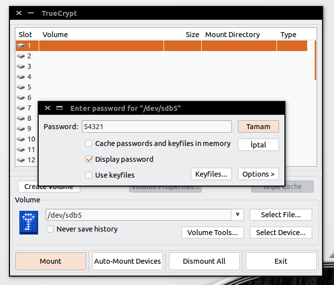

[1]: http://www.onaymetinkivilcim.com/Dersler/Truecrypt-Kullanimi/65
[2]: https://github.com/DrWhax/truecrypt-archive