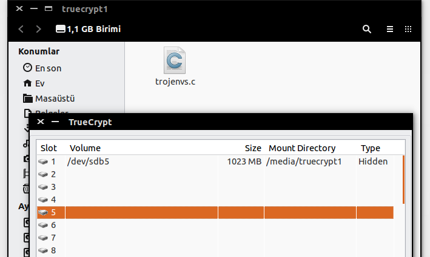

# Truecrypt kurulumu ve kullanımı

## Truecrypt Hakkında

- Sabit disklerin ve özellikle usb belleklerin şifrelenmesi için tercih edilen bir yazılımdır. Ayrıca şifreli dosya blokları oluşturmak için de kullanılabilir.
- Uzun süren geliştirilme süreci sonunda başarılı bir yazılım olan Truecrypt'ın, sebebi bilinmeyen bir şekilde bir anda anasayfasına "artık güvenli değil" yazılarak geliştirilmesi durduruldu.
- Yakın zamanda birçok akademisyenin ortak çalışması ile birlikte Truecrypt detaylıca incelendi. Yayınlanan sonuç raporuna göre de güvenilir olarak kabul edildi. Bu yüzden hala aktif bir şekilde kullanılmaktadır.

## Truecrypt Kurulum Platformu

- En son sürümü yayınlanan [Truecrypt 7.2][1], Windows ve MacOS işletim sistemi üzerinde şifreleme yapmamaktadır.
- Bunun için Windows ve MacOS platformunda veri şifrelemesi yapmak için [Truecrypt 7.1][2] sürümlerinden birisini kurmalısınız. Kendi sitesinde eski dağıtımlara ulaşmak mümkün olmadığı gibi bu dağıtımlara [github][2] üzerinden ulaşmanız mümkündür.

## Debian Tabanlı Dağıtımlar İçin Truecrypt Kurulumu

```
sudo add-apt-repository ppa:stefansundin/truecrypt
sudo apt-get update
sudo apt-get install truecrypt
````
- Yukarıdaki komutları sırasıyla terminal üzerinde çalıştırıyoruz. 

```
/etc/apt/sources.list.d/*********.list.save
```

- Yukarıdaki gibi bir hata ile karşılaşırsanız aşağıdaki komutu çalıştırarak sorunu çözebilirsiniz. Ancak bu komutların tam olarak ne yaptığını araştırma yaparak öğrenmek faydalı olacaktır

````
sudo rm -rm /etc/apt/sources.list.d
```

- İşlem bittikten sonra terminal üzerinden **truecrypt** yazarak programı çalıştırmanız mümkündür. 

## Truecrypt USB Disk Şifreleme

- Programı çalıştırdıktan sonra aşağıdaki adımları takip edebilirsiniz.


- **Create Volume** seçeneğini seçelim. Eğer bu buton görünmüyorsa, sürümün **7.2** olmadığını kontrol etmelisiniz. Sürüm sıkıntısından yukarıda bahsedilmiştir.


- Karşımızda 2 seçenek bulunuyor. 1. seçenek diskten belirli bir bloğu şifreleme işlemi için tercih edilir.
- İkinci seçenekte ise USB bellek gibi bir cihazın tamamını şifreleme işlemini yapmanızı sağlar. İkinci seçeneği seçerek devam edelim.


- İlk işlem normal bir Truecrypt containeri oluşturmanızı sağlar.
- İkinci işlem ise var olan bir container içerisinde gizli bir container daha oluşturmaya yarar. Bu sayede aynı disk iki farklı şifre ile açılabilir olmaktadır. Önem derecesine göre verilerinizi bu bölgelere yerleştirebilirsiniz.


- **Select Device** tıklayarak resimdeki diskler arasında şifrelemek istediğiniz cihazı seçmelisiniz. Daha sonra **Next** ile ilerleyebilirsiniz.


- Şifreleme ve Hash yöntemlerini seçmelisiniz. İlk başta default seçenekler ile işlemi tamamlamanız önerilir. İyi bir seçim yapılmak isteniyorsa **AES-Twofish-Serpent** şifrelemesi ile **Whirlpool** hash algoritması seçilebilir.


- Diskiniz içerisindeki verilere erişmenizi sağlayacak parolanızı giriniz.


- Şifreleme işlemi sırasında Truecrypt random bazı değerlere ihtiyaç duymaktadır. Bu random değerleri üretmek için mouse hareketleriniz kullanılmaktadır. Bu yüzden ilgili ekrana gelindiğince ne kadar uzun süre mouse pencere içerisinde hareket ettirilirse o derece yüksek karmaşıklığa sahip şifreleme işlemi gerçekleştirilecektir. Random pool değerlerinin gösteriminin kapatılması ile daha ileri seviyede güvenlik önemli alınabilir.
- Bu işlem bittikten sonra karşınıza klasör gelecektir ve şifreleme işlemi için arayüz size yönlendirme yapacaktır. Yine next dedikten sonra karşınıza hash ve şifreleme algoritmaları seçme arayüzü gelecektir.
- Yukarıda yapılan benzer işlemler gerçekleştirildiğinde en son aşağıdaki ekrana ulaşılacaktır. Burada ulaşılan kısım artık gizli container bölgesinin işlemleridir.


- Şifreyi belirledikten sonra yukarıdaki iterasyonu devam ettirelim.


- Şifreleme işlemimiz tamamlanmıştır.

## Truecrypt Şifrelenmiş Cihazı Kullanmak

- Bu işlemi yapmak için **Truecrypt** programına sahip olmanız gerekmektedir. Programı çalıştırdıktan sonra **Volume** üzerinden diski seçmelisiniz. Aşağıda şifreli diskimize standart şifremiz ile giriş yapılmasıyla, gizli şifremiz ile giriş yapılması sonucunda oluşan durumlar gösterilmektedir.

### Normal Container


### Gizli Container





[1]: http://www.onaymetinkivilcim.com/Dersler/Truecrypt-Kullanimi/65
[2]: https://github.com/DrWhax/truecrypt-archive
