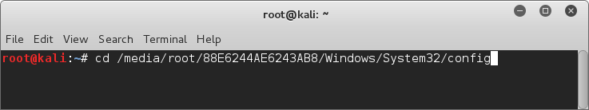
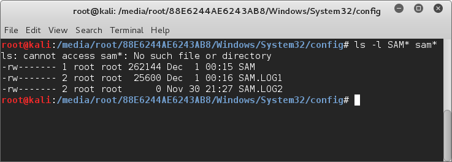
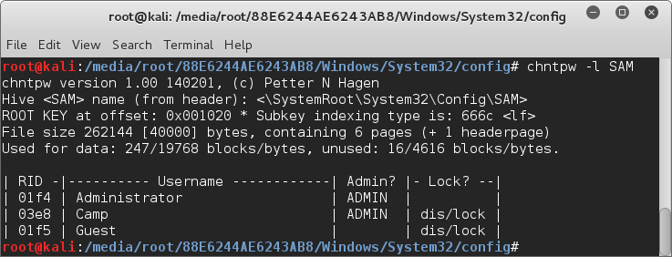
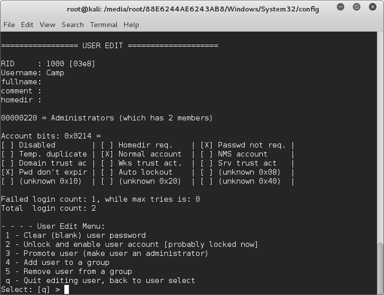

# Windows Şifre

## Kullanıcı Hesabı Düzenleme

- Kali Linux'u Windows işletim sisteminin kurulu olduğu makinede USB disk veya CDROM kullanarak boot ediyoruz.
- Boot işlemi sonunda harddisk yolu belirlenmelidir. Bunun için **lsblk** komutu kullanılabilir.
- Disk adı ve yolu bulunduktan sonra **mount** komutu ile bağlanacaktır. İlgili bağlama işlemi Kali'nin üst kısımlarında yer alan panelden de gerçekleştirilebilir. Örnekte bu şekilde yapılmıştır. Haliyle disk **/media/root/** yolu altındaki alt klasöre bağlanmıştır.
- Dizin başarıyla bağlandıktan sonra **Windows/System32/config** yoluna gidilir.

- Bu klasör altında Windows'un kullanıcı hesabı bilgilerinin depolandığı **.sam** dosyaları vardır. Aşağıdaki resim bu dosyaları göstermektedir.

- SAM dosyalarının içeriğini görmek için **chntpw -l SAM** komutu kullanılabilir.

- Ekranda gözüken listede hesaplar ve hesapların bazı özellikleri yazmaktadır. Düzenlemek istediğiniz hesabı **chntpw** aracına **-u** parametresi vererek seçebilirsiniz. Mesela **Camp** kullanıcısı için **chntpw -u Camp SAM** yazmanız yeterlidir.

- Gelen ekran kullanıcı hesabı ile ilgili daha fazla detay içermektedir.
- Bu ekranda 1,2,3,4,5 ve q komutları kullanılarak bazı işlemler gerçekleştirilebilir.
- **1:** Kullanıcının şifresini kaldır
- **2:** Kilidi kaldır ve hesabı aktif et(burada hesabın aktif durumunu gösteriyor)
- **3:** Hesabı yükselt yani hesaba admin yetkilerini ver
- **4:** Bir gruba kullanıcı hesabı ekle
- **5:** Bir gruptan kullanıcı sil
- **q:** Çıkış
- Burdan dilediğiniz işlemleri uyguladıktan sonra q seçimini yaparak çıkabilirsiniz. "q" seçimini yaptıktan sonra değişiklikleri onaylıyorsanız "y" seçip kaydediniz.
- Ardından bilgisayarınızı yeniden başlatıp uyguladığınız değişikliklerin sonuçlarını alabilirsiniz.
